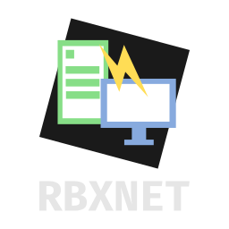

    
    <h2>Advanced multi-language networking library for Roblox.</h2>
    
RbxNet is a <i>networking library</i> for Roblox, built in TypeScript. It simplifies the creation and management of networking in Roblox.

## Features

- Creation and usage of remotes through "identifiers". Management of the remotes themselves are done by Net itself.
- Ability for remote definitions through `Net.Definitions`.
- Asynchronous functions - `Net.*.AsyncFunction`. No more pitfalls of regular remote functions.
- Ability to add serialization/deserialization for classes through `Net.Serialization`
- Asynchronous callbacks and methods: because it's a roblox-ts library, it supports promises.
- Middleware - Ability to add your own custom behaviours to remotes. Net comes with a runtime type checker, and a rate limiter middleware.
- `Net.*.GameMessagingEvent` - interact with `MessagingService` like you would with regular remote events. Cross-server communication with the simple API. All the limitations are handled by Net.

# Documentation:

[Available Here](https://docs.vorlias.com/rbx-net/)

# Version 3.0
## Changes from 2.x
- The second argument of `Net.Definitions.Create` was changed to an object, which now contains `GlobalMiddleware` and `Serializers`.
- Deprecation of `Get` for client definitions.
- Addition of `Net.On` - To use for event logging/analytics purposes when weird things happen with Net.
- Addition of the `Net.Serialization` namespace.
- Behaviour changes on client with `OnEvent` and `OnFunction` (now async, and uses `WaitFor`) for namespaces/definitions.
## Changes from 1.x
See [MIGRATION](MIGRATION.md)

